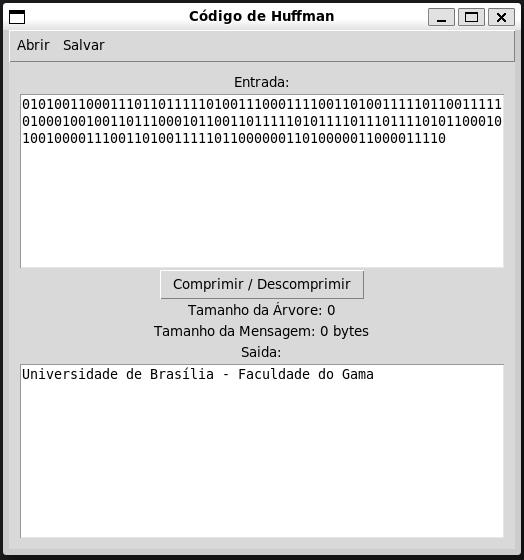

# Compressor Huffman

[Vídeo de apresentação](https://youtu.be/ihqoDbjzobE)

**Número da Lista**: 1 
**Conteúdo da Disciplina**: Greed 

## Alunos

| Matrícula  | Aluno                        |
| ---------- | ---------------------------- |
| 19/0036567 | Pedro Lucas Cassiano Martins |
| 19/0020814 | Vinícius Roriz               |

## Sobre

O projeto Compressor Huffman é o terceiro trabalho da dupla para a disciplina de Projeto de Algoritmos e remete ao conteúdo de algoritimos ambiciosos (ou greed) abrangendo Interval Partitioning, Interval Scheduling, Knapsack, Huffman, etc.
O objetivo do projeto é criar uma interface gráfica capaz de receber textos e comprimi-los ou descomprimi-los, contando com a funcionalide de abrir e salvar arquivos. Utilizamos para esse projeto o código de Huffman.
O algoritmo é capaz de comprimir textos digitados pelo usuários que então é mostrado em uma caixa de texto o texto (comprimido) em binário e também é capaz de fazer o contrário.

## Screenshots

## Instalação

**Linguagem**: Python 

##### Execute a main.py

`$ python3 src/main.py`

## Uso

1. Escreva uma mensagem na entrada;
2. Aperte o botão de comprimir / descomprimir;
3. Salve a mensagem comprimida em "Salvar";
4. No botão "Abrir" você pode abrir mensagens comprimidas ou descomprimidas para realizar a operação inversa.
